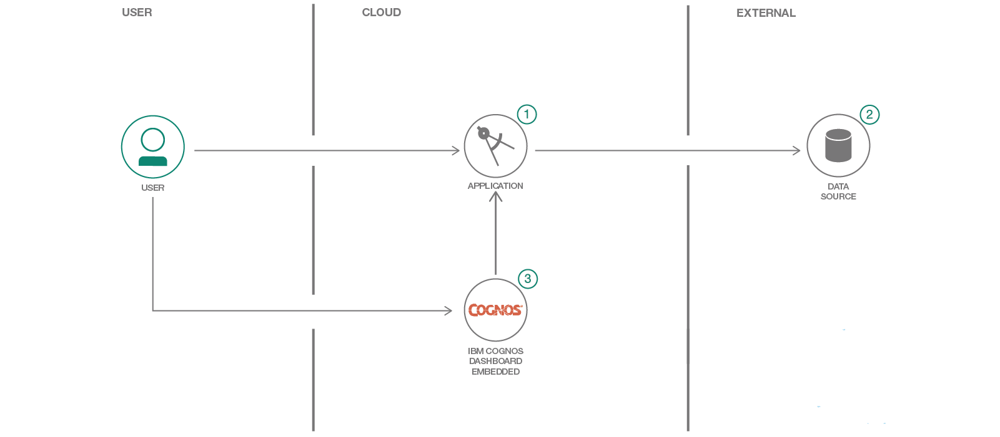
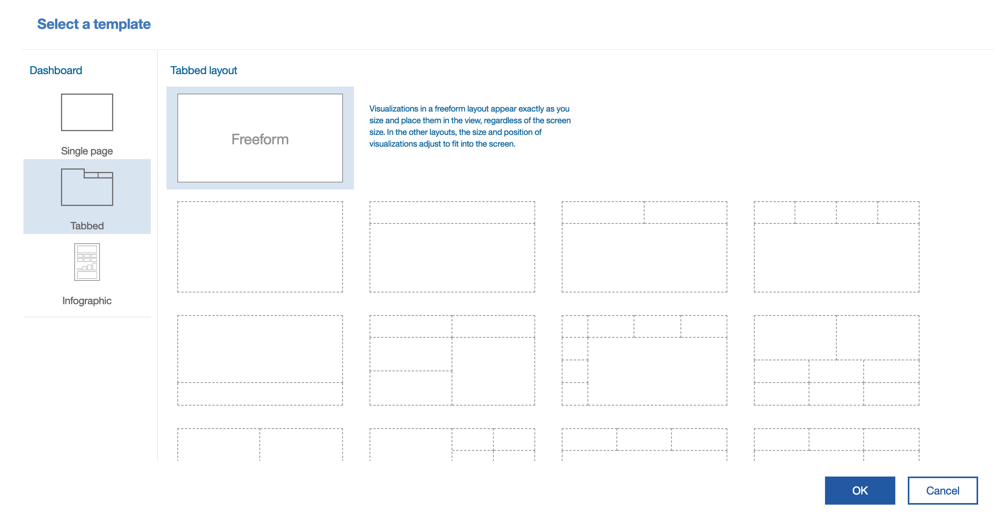
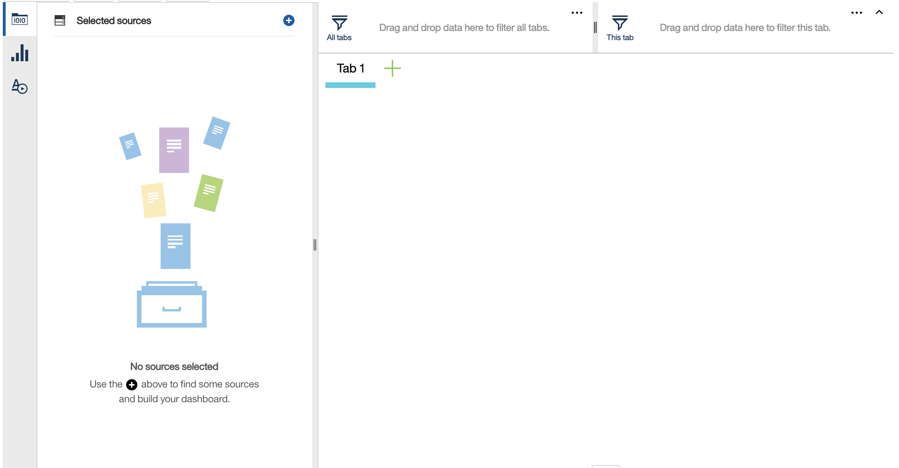

# Tutorial IBM Cognos Dashboard Embedded
Tutorial para comenzar a usar IBM Cognos Dashboard Embedded

## Arquitectura de la solución


## Pre-requisitos
* [Git](https://git-scm.com/downloads)
* [IBM Cloud Account](https://cloud.ibm.com)
* [Node v6.9.0 or higher](https://nodejs.org/en/)
* Precisamos descargar el archivo [CognosApi.js](https://dde-us-south.analytics.ibm.com/daas/CognosApi.js).
Este archivo lo incluimos en nuestro archivo html de la siguiente manera. (Ya está descargado y se encuentra en la siguiente ruta: public/javascripts)
```bash
<html>

  <head>
    ...
    ...
    ...
  </head>

  <body>
    <div id="dashboardPlace">
      ...
    </div>

    <script src="javascripts/CognosApi.js"></script>

  </body>
</html>
```
* The CognosApi.js file is available from the Cognos Dashboard Embedded service instance:

## 1er paso - IBM Cloud
Ingresamos a IBM Cloud, con nuestro usuario y creamos un servicio de [IBM Cognos Dashboard Embedded](https://cloud.ibm.com/catalog/services/ibm-cognos-dashboard-embedded).
<p align="center">
	
</p>

Luego de crear el servicio, creamos credenciales para la instancia y anotamos los siguientes campos para tenerlos a mano:
* API_endpoint_url
* Apikey
* Client_id
* Client_secret

## 2do paso - Configurar ambiente
Clonamos el proyecto: ``` $ git clone ```
<br />
Instalamos todas las librerias requeridas: ``` $ npm install ```


## 3er paso - IBM Cognos Dashboard Embedded, sesion.
(El siguiente codigo se encuentra en el archivo app.js.)

El uso de este servicio es mediante sesiones. Cada sesion es de 60 minutos.

Una sesion se crea una vez que se realiza una llamada a la API del servicio IBM Cognos Dashboard Embedded, para realizar esta llamada tenemos que proporcionar una clave codificada en base 64. Esta clave es el resultado de codificar "client_id:client_secret".
Debajo se muestra como se realiza esto:
```bash
var authorization_key = Buffer.from(process.env.CLIENT_ID+":"+process.env.CLIENT_SECRET).toString('base64')
console.log(authorization_key);
```

En el siguiente fragmento creamos un endpoint (a ser llamado del lado del cliente) donde se realiza la llamada a la API para obtener un codigo de una nueva sesion.
```bash
app.post("/api/dde/session", function(request, response) {
  var options = {
    method: "POST",
    uri: process.env.API_ENDPOINT_URL,
    headers: {
      "Authorization": `Basic ${authorization_key}`,
      "content-type": "application/json"
    },
    body: {
      "expiresIn": 3600,
      "webDomain": process.env.WEB_DOMAIN
    },
    json: true // Automatically stringifies the body to JSON
  };

  rp(options)
    .then(function (parsedBody) {
      // POST succeeded...
      console.log("post suceeded");
      console.log(JSON.stringify(parsedBody));
      return response.json(parsedBody);
    })
    .catch(function (err) {
      // POST failed...
      console.log("post failed!");
      console.log(JSON.stringify(err));
      return response.json(err);
    });
});
```

Ejemplo de respuesta:
```bash
  {
    "sessionId": "SN401234567801933ccccf",
    "sessionCode": "CDfc21234567875e06a",
    "keys": [
      {
        "kty": "RSA",
        "e": "AQAB",
        "use": "enc",
        "kid": "58110ceb123456787f417e6298",
        "alg": "RSA",
        "n": "AJG6QxPXGdn...clipped"
      }
    ]
  }
```

## 4to paso - Dashboard.

El procedimiento para crear el dashboard es el siguiente:
1. Crear una nueva sesion.
2. Inicializar el framework de la API.
3. Crear un Dashboard.
4. Cargar datos.
5. Modelar los datos
6. Guardar y abrir Dashboards.

### 4.1 - Crear una nueva sesion
Lo siguiente se ejecuta apretando el siguiente botón.
<p align="center">
  
</p>
¿Que hacemos en esta etapa?
Realizamos una llamada el endpoint que creamos en el paso 3 y obtenemos el codigo.

```bash
async function createNewSession() {
	session;
	if (this.api != null) {
	  console.log("There was already an api object");
	} else {
	 	var http = new XMLHttpRequest();
	  	http.open('POST', '/api/dde/session', true);
	  	http.setRequestHeader('Content-type', 'application/json');
	  	http.onreadystatechange = function() {
	    if (http.readyState === 4 && http.status === 200 && http.responseText) {
	    	response = http.responseText
	      	const data = JSON.parse(response);
	      	session.code = data.sessionCode;
	      	session.id = data.sessionId;
	      	session.keys = data.keys;
	      	createAndInitApiFramework();
	      	return this.session;
	      	}
	  	};
	  	http.send()
	}
}
```

### 4.2 - Se inicializa el framework de la API.
Podemos ver que invocamos a la funcion createAndInitApiFramework.

```bash
  this.api = new CognosApi({
  cognosRootURL: 'https://us-south.dynamic-dashboard-embedded.cloud.ibm.com/daas/',
  sessionCode: session.code,
  initTimeout: 10000,
  node: document.getElementById('containerDivId') // containerDivId
});
```
cognosRootURL: Hace referencia a la API_endpoint_url de nuestras credenciales.
sessionCode: Hace referencia al codigo de la sesion que nos envío el servidor.
initTimeout: Es la cantidad de milisegundos que esperamos por una respuesta.
node: Hace referencia al lugar en la pagina HTML donde se va a embeber el dashboard.

Notaremos que aparece un gif de loading.


### 4.3 - Se crea un dashboard.
Por ultimo se invoca la funcion createDashboard()

```bash
async function createDashboard()  {
	if (this.api.dashboard != null) {
	 	this.dashboardAPI = await this.api.dashboard.createNew();
	 	console.log('Dashboard created successfully.');
	 	this.dashboardAPI.state = 'Create';
	 	return this.dashboardAPI;
	} else {
	  	console.log('Dashboard is not created.');
	}
}
```

##### Este será el resultado:


##### Luego se elige un template y se comienza a trabajar con los datos:


### 4.4 - Se carga un archivo de datos.

Para agregar un archivo de datos al dashboard es necesario ejecutar el metodo ```addSources()``` provisto por la API:

```bash
this.dashboardAPI.addSources([{
  module: sampleModule,
  name: 'Test Source',
  id: 'myUniqueId123'
}])
```
Donde name es el nombre con el que el archivo se mostrará en el dashboard y el id es como se lo va a identificar.

<br />
El campo module hace referencia a un objeto java que tiene las referencias al archivo de datos, contiene los siguientes campos:
```bash
module = {
"xsd": "https://ibm.com/daas/module/1.0/module.xsd",
"source": {
  "id": "IDENTIFICADOR DE LA FUENTE",
  "srcUrl": {
    "sourceUrl": "RUTA AL ARCHIVO CSV".
    "mimeType": "text\/csv", "TIPO DEL ARCHIVO"
    "property": [
      {
        "name": "separator",
        "value": ", "
      },
      {
        "name": "ColumnNamesLine",
        "value": "true"
      }
    ]
  }
},
"table": { // DATOS ACERCA DE LAS COLUMNAS DEL ARCHIVO.
  "name": "TableName",
  "column": [
    {
      "datatype": "BIGINT",
      "nullable": true,
      "name": "Year_",
      "description": "Year",
      "label": "Year",
      "usage": "attribute",
      "regularAggregate": "none",
      "taxonomyFamily": "cYear"
    },
    {
      "datatype": "NVARCHAR(20)",
      "nullable": true,
      "name": "Product_type",
      "description": "Product type",
      "label": "Product type",
      "usage": "attribute",
      "regularAggregate": "none"
    },
    {
      "datatype": "NVARCHAR(17)",
      "nullable": true,
      "name": "Order_method_type",
      "description": "Order method type",
      "label": "Order method type",
      "usage": "attribute",
      "regularAggregate": "none"
    },
    {
      "name": "Retailer_country",
      "datatype": "NVARCHAR(16)",
      "nullable": true,
      "description": "Retailer country",
      "label": "Retailer country",
      "usage": "attribute",
      "regularAggregate": "none",
      "taxonomyFamily": "cCountry"
    },
    {
      "datatype": "DOUBLE",
      "nullable": true,
      "name": "Revenue",
      "description": "Revenue",
      "label": "Revenue",
      "usage": "fact",
      "regularAggregate": "total"
    },
    {
      "datatype": "DECIMAL(38, 0)",
      "nullable": true,
      "name": "Quantity",
      "description": "Quantity",
      "label": "Quantity",
      "usage": "fact",
      "regularAggregate": "total"
    }
  ]
},
"label": "Module Name",
"identifier": "moduleId"
```

##### Para cargar un archivo de datos, hay tres alternativas maneras:
1.  En el botón de + que está al lado de donde dice selected sources:

<br />
En este caso cuando se da click al botón con el simbolo de "+" y se dispara un evento, cuando se registra ese evento ahí se debería modelar como se quisiera: abriendo un modal con distintos archivos ya cargados y con los valores anteriores ya definidos o abriendo un explorador de archivos y cargar estos valores dinamicamente:

##### Eventos
```bash
  dashboardAPI.on('addSource:clicked', sourceClicked)
```
El metodo on() nos registra a distintos eventos, en particular aca nos estamos registrando al evento de cuando se clickea el boton para agregar fuentes de datos.
Luego en la funcion sourceClicked, se implementar lo que el usuario quiera. En este tutorial cargaremos un archivo previamente definido.

Podríamos si quisieramos modelar otros eventos como por ejemplo, cuando se modifica el dashboard.
```bash
  dashboardAPI.on(dashboardAPI.EVENTS.DIRTY, onModified);
```

De la misma manera que nos registramos a eventos, invocando el metodo ```off()``` anulamos el registro del evento pasado como atributo.
Por ejemplo:
```bash
  dashboardAPI.off(dashboardAPI.EVENTS.DIRTY, onModified);
```

2. Dandole click a un boton externo al Dashboard (Add data) donde agregue un conjunto de datos con todos los valores mencionados anteriormente ya definidos.
<p align="center">
  
</p>

#### 4.5 - Modelar los datos.
Basicámente se basa en drag and drop.


#### 4.6 - Guardar y abrir un dashboard.
Cada dashboard tiene un conjunto de especificaciones, que va cambiando a medida que se realizan modificaciones y se trabaja con el dashboard. Estas especificaciones las podemos obtener llamando a la API del servicio mediante usando
``` bash
  async function saveDashboard()  {
    if (this.api.dashboard != null) {
      var dashboardSpec = this.dashboardAPI.getSpec();

      // Conectarse con alguna base de datos a eleccion: MongoDB, Cloudant...
      // Guardar dashboardSpec

      console.log('Dashboard was successfully saved.');
    } else {
      console.log('Dashboard was not saved.');
    }
  }
```

Luego si persisitmos los datos retornados por ese metodo, invocando la funcion ```openDashboard()``` podriamos llegar a seguir modificando el mismo dashboard.

```bash
  async function openDashboard()  {
    // Pedirle a a la base de datos donde guardamos las spec de los otros dashboards. Podria ser MongoDB, Cloudant...
    try {
      this.dashboardAPI = await this.api.dashboard.openDashboard({
        dashboardSpec: "dashboard elegido"
      })
      console.log("Dashboard successfully loaded")
    } catch (e) {
      console.log('Unable to load that Dashboard: ' + e.message);
      throw e;
    }
  }
```


